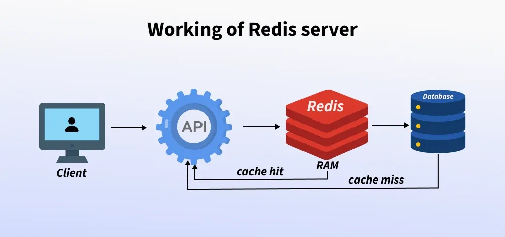

# Redis Flask Application Demo

## What is Redis?
The full form of Redis is **REmote DIctionary Server**, an open-source, in-memory data structure store used as a high-performance database, cache, and message broker for real-time applications, storing data in key-value pairs with flexible data structures like strings, lists, and hashes.

> **Quick Summary**: Redis is an in-memory **NoSQL** key–value database often used for caching, counters, and real-time data.
>
> **Top Use Cases**:
> *   **Caching** frequently accessed data to improve access time.
> *   **Session storage** for web applications.
> *   **Real-time analytics and leader boards**.
> *   **Managing queues** or task lists in background job systems.

This project demonstrates a simple Flask application interacting with a Redis database.

---

## 2. Redis Basics You Should Know

Before diving into operations, here are the fundamental concepts every Redis developer should know:

### What is a "Key-Value Pair"?
At its heart, Redis is a **Key-Value Store**.
*   **Key**: The unique identifier (like a variable name or a dictionary word).
*   **Value**: The data associated with that key.

**Analogy**: Think of a traditional **Dictionary**.
*   **Key**: "Apple" (The specific word you look up).
*   **Value**: "A round red fruit..." (The definition found at that location).
You simply use the *Key* to instantly find the *Value*.

### How Redis actually stores data
Think of Redis like this:
**KEY**  →  **VALUE** (data structure)

*   The **key** is always a string.
*   The **value** can be one of many data types.

### Core Data Types
*   **1️⃣ Strings (Simplest)**
    *   Command: `SET page:home "<html>...</html>"`
    *   Structure: `page:home` → `"html content"`
    *   *Used for*: Cache, Tokens, Counters, Flags.

*   **2️⃣ Lists (Ordered Collection)**
    *   Command: `LPUSH orders order1`, `LPUSH orders order2`
    *   Structure: `orders` → `["order2", "order1"]`
    *   *Note*: Still one key → one list.
    *   *Used for*: Queues, Job processing, Call logs (FIFO).

*   **3️⃣ Sets (Unique values, Unordered)**
    *   Command: `SADD unique_ips 192.168.1.1`, `SADD unique_ips 192.168.1.2`
    *   Structure: `unique_ips` → `{192.168.1.1, 192.168.1.2}`
    *   *Used for*: Unique visitors, Tags, Permissions.

*   **4️⃣ Hashes (Like Objects / Dictionaries)**
    *   Command: `HSET user:101 name "Ramu" age 30 email "ramu@mail.com"`
    *   Structure:
        ```text
        user:101 → {
          name: "Ramu",
          age: "30",
          email: "ramu@mail.com"
        }
        ```
    *   *Used for*: User profiles, Configurations, Session data.

*   **5️⃣ Sorted Sets (Value + Score)**
    *   Command: `ZADD leaderboard 100 "player1"`, `ZADD leaderboard 200 "player2"`
    *   Structure:
        ```text
        leaderboard → {
          player1: 100,
          player2: 200
        }
        ```
    *   *Used for*: Rankings, Priority queues, Analytics.
    *   *Fun Fact*: Why **Z**? Since **S** was taken for Sets (`SADD`), Redis uses **Z** for Sorted Sets (`ZADD`). Some say it stands for "Z-axis" (ordering) or just because it looks like an S turned sideways!

### Key Characteristics
*   **In-Memory**: All data is held in RAM for extreme speed (sub-millisecond latency).
*   **Persistence**: While in-memory, it persists data to disk (RDB/AOF) so you don't lose it on restart.
*   **Single-Threaded**: Redis uses a single thread for data processing, avoiding context-switching overhead and ensuring atomic operations.

### Why Redis is so Fast?
1.  **In-Memory Storage**: Keeps all data in RAM, avoiding slow hard drive reads.
2.  **Single-Threaded Event Loop**: Avoids the complexity and overhead of context switching and locks found in multi-threaded systems.
3.  **Efficient Data Structures**: Uses highly optimized structures (like Skip Lists for Sorted Sets) for performance.
4.  **RESP Protocol**: A simple, lightweight communication protocol that lets clients talk to Redis with minimal delay.

---

## 3. Redis Operations & Concepts

### How to Start and Stop Redis

On Windows, Redis usually runs as a **Background Service** or a **Console Application**.

#### Implementation 1: If using a Windows Port (e.g., Memurai or Microsoft Archive)
*   **Start**: 
    open `Services` (Win+R -> `services.msc`), find `Redis` or `Memurai`, right-click -> **Start**.
    *   *Command Line*: `net start redis`
*   **Stop**: 
    open `Services`, right-click -> **Stop**.
    *   *Command Line*: `net stop redis`

#### Implementation 2: If running manually (CLI)
*   **Start**: Open a terminal and run `redis-server`
*   **Stop**: Press `Ctrl+C` in that terminal, or run `redis-cli shutdown` in another terminal.

### How to Verify Redis is Running
If you are unsure if the server is active, you can check using the command line or Windows Services.

#### Method 1: Check Open Ports (Netstat)
Run the following command to see if Redis is listening on its default port **6379**:
```cmd
netstat -ano | findstr 6379
```
*Expected Output:*
```cmd
  TCP    127.0.0.1:6379         0.0.0.0:0              LISTENING       5456
```
*(If you see this, Redis is running!)*

#### Method 2: Check Windows Services
1.  Run `services.msc` (Win+R -> `services.msc`).
2.  Look for **Redis** or **Memurai** in the list.
3.  Check if the **Status** is "Running".

### Where is data stored? (Persistence)

Redis is in-memory, but it has two ways to save data to disk so it survives restarts.

#### A) RDB (Snapshotting)
Redis takes periodic snapshots of memory and writes them to a file.
*   **Default file**: `dump.rdb`
*   **Default location**:
    *   **Linux/macOS**: `/var/lib/redis/`
    *   **Windows**: Usually the installation folder (e.g., `C:\Program Files\Redis\`) or wherever `redis-server.exe` is.

#### B) AOF (Append Only File)
Every write operation is logged to disk. It is more durable than RDB but the file can grow larger.
*   **File**: `appendonly.aof`
*   **Location**: Same directory as configured in Redis.

#### How to check where YOUR Redis stores data
You can find the exact location by running this inside the **Redis CLI**:
```redis
CONFIG GET dir
```
*Example output:*
```
1) "dir"
2) "/var/lib/redis"  (or C:\Program Files\Redis\...)
```

To see the specific filenames:
```redis
CONFIG GET dbfilename
CONFIG GET appendonly
```

#### Quick Summary
| Storage Type | Where |
| :--- | :--- |
| **Default** | RAM only (until snapshot) |
| **RDB enabled** | `dump.rdb` in Redis dir |
| **AOF enabled** | `appendonly.aof` in Redis dir |

> [!IMPORTANT]
> **Use Case Note**: Redis is best for **cache, sessions, counters, and queues**. It is NOT ideal as permanent primary storage unless persistence is carefully configured.

### Common Use Cases

| Use Case | Why Redis? | Example |
| :--- | :--- | :--- |
| **Caching** | **Speed.** RAM is 1000x faster than a hard drive database (SQL). | Storing user profiles, session data, or API responses. |
| **Real-time Analytics** | **Atomic Counters.** Handles millions of writes per second. | Live view counters, likes/upvotes, leaderboards. |
| **Message Queues** | **Lists.** Fast FIFO processing. | Job queues, chat room messages. |
| **Session Store** | **Expiration (TTL).** Keys can auto-expire. | User login tokens. |

### Scene: When to Use Redis Server?


**Scenario**: You have a MySQL database and are constantly querying it.
1.  **The Problem**: Reading from secondary storage (disk) takes time (100–1000 ms).
2.  **The Fix**: Store the result in Redis after the first query.
3.  **The Result**: Next time, check Redis first. It returns the data instantly from memory.

> **Note**: In a **Messaging App**, Redis is often used to store the "Last 5 Messages" using a **List**. It's fast and perfect for transient data.

---

## 4. Code Breakdown & Features Guide

This section breaks down the `app.py` code, explaining each feature's concept, implementation, and real-world usage.

### 1. The Setup
```python
r = redis.Redis(host='localhost', port=6379, decode_responses=True)
```
*   **What it does**: Connects Flask to the Redis server. `decode_responses=True` ensures we get text strings back instead of raw bytes.

---

### 2. The Visit Counter (Atomic Increments)
```python
@app.route("/visit")
def visit():
    count = r.incr("visits")
    return f"Total visits: {count}"
```
*   **Concept**: Uses `INCR` to atomically add +1 to a counter. Safe even with multiple concurrent users.
*   **Industry Example**: **YouTube Views**. When millions of people watch a video at once, Redis counts them so no view is lost.

---

### 3. Key-Value Storage (Strings)
```python
@app.route("/set/<key>/<value>") ... r.set(key, value)
@app.route("/get/<key>") ... r.get(key)
```
*   **Concept**: Direct mapping of `SET` and `GET` commands to store/retrieve strings.
*   **Industry Example**: **Caching API Responses**. Saving the result of a heavy database query (like a user's profile JSON) so the next load is instant.

---

### 4. 🏆 The Leaderboard (Sorted Sets)
**Concept**: Real-time ranking using `Sorted Sets` (`ZADD`, `ZRANGE`). Redis automatically keeps items sorted by their score.
*   *Fun Fact*: Why **Z**? Since **S** was taken for Sets, Redis uses **Z** for Sorted Sets.

```python
# Add Score (ZADD)
r.zadd("leaderboard", {player: float(score)})

# View (ZREVRANGE)
r.zrevrange("leaderboard", 0, 2, withscores=True)
```
*   **What it does**:
    *   `ZADD`: Adds a player; Redis inserts them in the correct rank instantly.
    *   `ZREVRANGE`: Fetches Top 3 players, highest score first.
*   **Industry Example**: **Gaming (PUBG/COD)**. Ranking millions of players by Kill/Death ratio in real-time. Also used by **Twitter Trends** to rank hashtags.

---

### 5. ⏳ Ephemeral Messaging (TTL)
**Concept**: Data expiration using `Time-To-Live` (`EXPIRE`). Often called **Ephemeral Messaging**.

```python
# SET with Expiration (10 seconds)
r.set("secret_msg", message, ex=10)
```
*   **What it does**: Saves a key with a "time bomb" (`ex=10`). Redis auto-deletes it after 10 seconds.
*   **Industry Example**:
    *   **Snapchat/Instagram Stories**: Content that disappears after viewing.
    *   **Security (OTPs)**: Bank codes valid for only 60 seconds.
    *   **Sessions**: Login tokens that expire after 30 minutes.

---

## 5. Testing Your App

Follow these steps to verify all features using your browser.

### Prerequisites
Ensure your app is running: `python app.py`

### Feature Verification Checklist

| Feature | URL to Visit | Expected Result |
| :--- | :--- | :--- |
| **1. Connection** | `http://localhost:5000/` | `Redis is running on Windows!` |
| **2. Counter** | `http://localhost:5000/visit` | `Total visits: 5` (Increments on refresh) |
| **3. Store Value** | `http://localhost:5000/set/hero/Batman` | `Saved hero = Batman` |
| **4. Sort Rank** | `http://localhost:5000/leaderboard/add/Alice/500` | `Added Alice with score 500` |
| **5. View Rank** | `http://localhost:5000/leaderboard` | Shows Leaderboard with Alice listed. |
| **6. Secret (Start)** | `http://localhost:5000/secret/CodeRed` | `Secret message saved!` |
| **7. Secret (Check)**| `http://localhost:5000/get_secret` | `🤫 The secret is: CodeRed` (If <10s) |
| **8. Secret (End)** | Wait 10s... then Refresh above | `👻 This message has self-destructed` |

### Check Directly in Redis CLI
You can also inspect data using the `redis-cli` terminal:

```redis
KEYS *          # Lists all keys (visits, leaderboard, etc.)
GET visits      # Shows current count
ZRANGE leaderboard 0 -1 WITHSCORES  # Shows all players and scores
```
